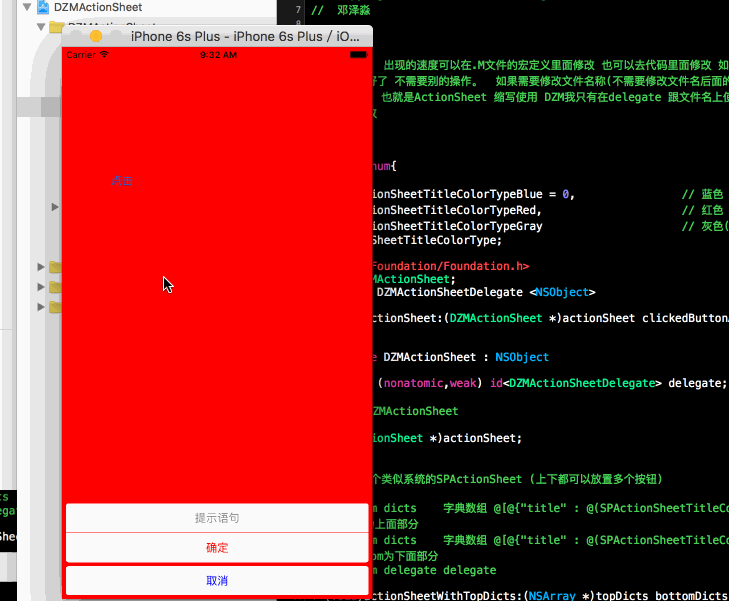

# DZMActionSheetDemo
无限循环图片轮播器Swift版。Autoscroll Banner。完美封装 

##实现代码

// 点击方法加上即可
- (IBAction)click:(id)sender {

/**
*  颜色可以随意改动的 我只是示范个例子 有这些使用 (上下都可以放置多个按钮)
*/
[DZMActionSheet actionSheetWithTopDicts:@[@{@"提示语句":@(ASActionSheetTitleColorTypeGray)},@{@"确定":@(ASActionSheetTitleColorTypeRed)}] bottomDicts:@[@{@"取消":@(ASActionSheetTitleColorTypeBlue)}] delegate:self];
}

--------------------------------------------------------------------------------------------------------------

##期待
* 如果在使用过程中遇到BUG，希望你能Issues我，谢谢!
* 如果在使用过程中发现功能不够用，希望你能Issues我.